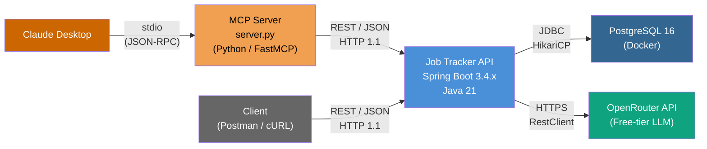
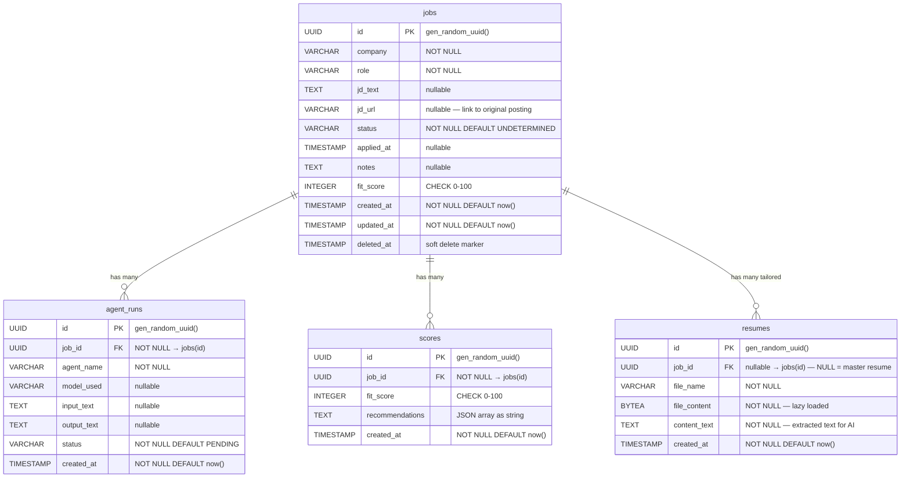
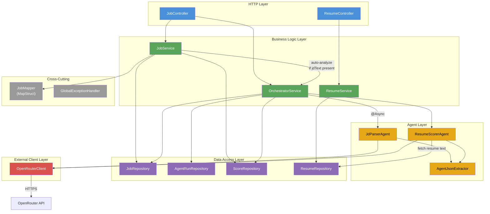
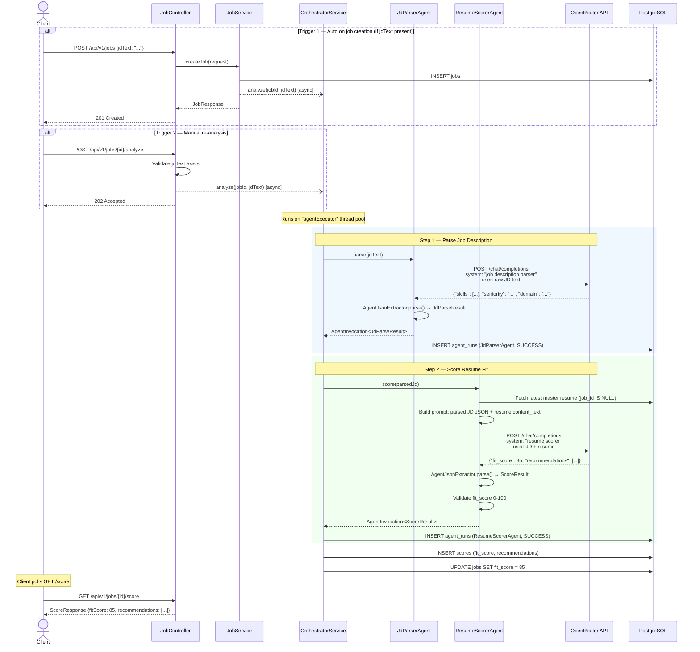
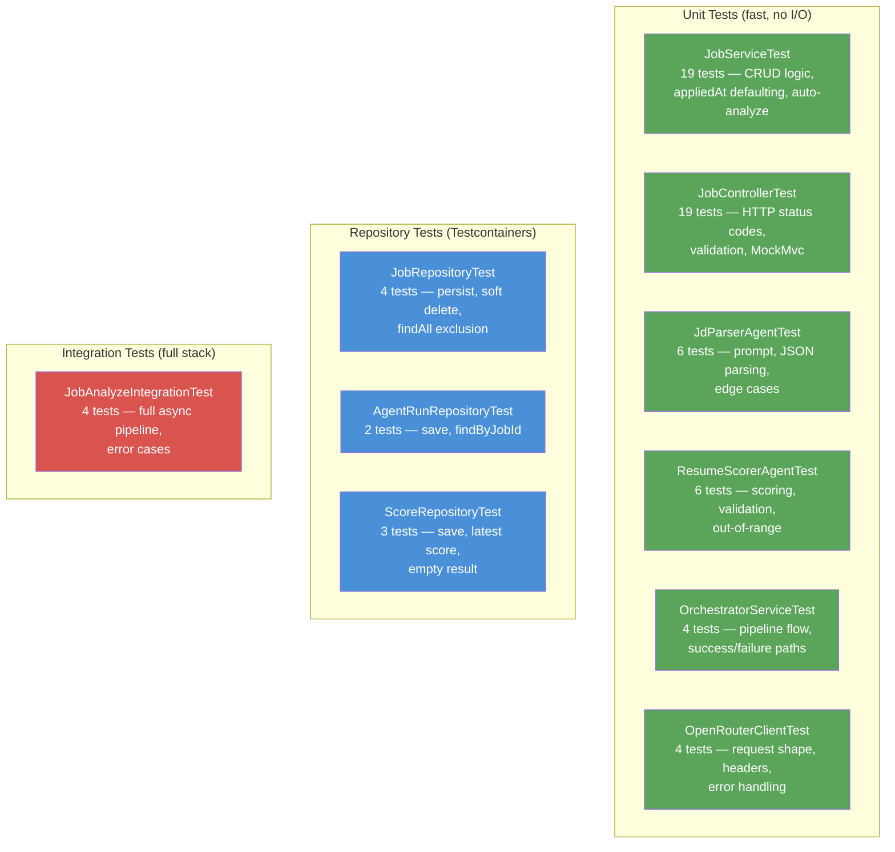

# Architecture Document — Job Application Tracker

> A Spring Boot REST API to track job applications, with full CRUD, soft delete, and an async AI scoring pipeline that analyzes job descriptions against a candidate's resume using OpenRouter LLMs.

---

## Table of Contents

1. [System Context](#1-system-context)
2. [Tech Stack](#2-tech-stack)
3. [API Reference](#3-api-reference)
4. [Data Models](#4-data-models)
5. [Architecture Layers](#5-architecture-layers)
6. [AI Scoring Pipeline](#6-ai-scoring-pipeline)
7. [Key Design Decisions](#7-key-design-decisions)
8. [Configuration](#8-configuration)
9. [Testing Strategy](#9-testing-strategy)
10. [CI/CD](#10-cicd)
11. [Implementation Phases](#11-implementation-phases)
12. [Future Roadmap](#12-future-roadmap)

---

## 1. System Context



The Spring Boot API is the only backend component we own. PostgreSQL runs locally via Docker. OpenRouter is a third-party LLM gateway. The MCP server is a thin Python process that Claude Desktop launches — it translates Claude's tool calls into HTTP requests to the REST API.

---

## 2. Tech Stack

| Layer          | Technology                          | Version  | Notes                                       |
|----------------|-------------------------------------|----------|---------------------------------------------|
| Language       | Java                                | 21       | Records, text blocks, sealed classes         |
| Framework      | Spring Boot                         | 3.4.4    | Web, Data JPA, Validation, Async            |
| Database       | PostgreSQL                          | 16       | Runs in Docker via `docker-compose`          |
| Migrations     | Flyway                              | 10.x     | Auto-runs on startup. 7 migrations (V1-V7)  |
| ORM            | Spring Data JPA / Hibernate         | 6.6.x    | `ddl-auto: validate` — schema via Flyway    |
| Mapping        | MapStruct                           | 1.6.3    | Compile-time, `ReportingPolicy.ERROR`        |
| PDF Parsing    | Apache PDFBox                       | 3.0.4    | Extracts plain text from uploaded PDFs       |
| HTTP Client    | Spring `RestClient`                 | 6.2.x    | Calls OpenRouter. Forced to HTTP/1.1         |
| AI Gateway     | OpenRouter                          | —        | Free-tier model: `arcee-ai/trinity-large-preview:free` |
| Build          | Gradle                              | 8.x      | Single-module project                        |
| Container      | Docker / docker-compose             | —        | App + DB both containerised; multi-stage Dockerfile |
| Testing        | JUnit 5, Testcontainers, WireMock   | —        | Real PostgreSQL in tests. WireMock for LLM   |
| Async Testing  | Awaitility                          | —        | Polling assertions for async pipeline        |
| CI/CD          | GitHub Actions                      | —        | PR checks: compile + full test suite         |

---

## 3. API Reference

All endpoints are under `/api/v1/jobs`.

### Jobs Endpoints

| Method   | Path                      | Request Body        | Response Body   | Status Codes          |
|----------|---------------------------|---------------------|-----------------|-----------------------|
| `POST`   | `/api/v1/jobs`            | `CreateJobRequest`  | `JobResponse`   | `201` Created, `400`  |
| `GET`    | `/api/v1/jobs`            | —                   | `JobResponse[]` | `200`                 |
| `GET`    | `/api/v1/jobs/{id}`       | —                   | `JobResponse`   | `200`, `404`          |
| `PATCH`  | `/api/v1/jobs/{id}`       | `UpdateJobRequest`  | `JobResponse`   | `200`, `404`          |
| `DELETE` | `/api/v1/jobs/{id}`       | —                   | —               | `204`, `404`          |

### AI Endpoints

| Method   | Path                           | Request Body | Response Body      | Status Codes                 |
|----------|--------------------------------|--------------|--------------------|------------------------------|
| `POST`   | `/api/v1/jobs/{id}/analyze`    | —            | `{message, jobId}` | `202` Accepted, `400`, `404` |
| `GET`    | `/api/v1/jobs/{id}/score`      | —            | `ScoreResponse`    | `200`, `404`                 |

### Resume Endpoints

| Method   | Path                                | Request Body         | Response Body    | Status Codes          |
|----------|-------------------------------------|----------------------|------------------|-----------------------|
| `POST`   | `/api/v1/resumes`                   | `multipart/form-data` (`file`) | `ResumeResponse` | `201`, `400` |
| `POST`   | `/api/v1/resumes?jobId={id}`        | `multipart/form-data` (`file`) | `ResumeResponse` | `201`, `400`, `404` |
| `GET`    | `/api/v1/resumes/master`            | —                    | `ResumeResponse` | `200`, `404`          |
| `GET`    | `/api/v1/resumes/master/download`   | —                    | file bytes       | `200`, `404`          |
| `GET`    | `/api/v1/resumes/job/{jobId}`       | —                    | `ResumeResponse` | `200`, `404`          |

### Request / Response Shapes

**CreateJobRequest**
```json
{
  "company": "Anthropic",          // required
  "role": "Staff Engineer",        // required
  "jdText": "We need a ...",       // optional — needed for /analyze
  "jdUrl": "https://...",          // optional — link to original job posting
  "status": "APPLIED",             // optional — defaults to UNDETERMINED
  "appliedAt": "2026-04-09T..."    // optional — auto-defaults (see below)
}
```

**UpdateJobRequest**
```json
{
  "status": "INTERVIEWING",        // optional — null means no change
  "notes": "Passed phone screen"   // optional — empty string clears it
}
```

**JobResponse**
```json
{
  "id": "uuid",
  "company": "Anthropic",
  "role": "Staff Engineer",
  "status": "APPLIED",
  "appliedAt": "2026-04-09T01:42:55",
  "notes": "Spoke to recruiter",
  "jdUrl": "https://jobs.anthropic.com/...",
  "fitScore": 85,
  "createdAt": "2026-04-09T01:42:55"
}
```

**ResumeResponse**
```json
{
  "id": "uuid",
  "jobId": null,
  "fileName": "resume.pdf",
  "contentText": "John Doe\nSoftware Engineer...",
  "createdAt": "2026-04-09T01:42:55"
}
```

**ScoreResponse**
```json
{
  "id": "uuid",
  "jobId": "uuid",
  "fitScore": 85,
  "recommendations": ["Add GCP experience", "Highlight Kafka", "Mention payments"],
  "createdAt": "2026-04-09T01:43:56"
}
```

### Error Response Shape

```json
{
  "timestamp": "2026-04-09T01:46:01",
  "error": "NOT_FOUND",
  "message": "Job not found: 00000000-..."
}
```

| Error Code           | HTTP Status | When                                    |
|----------------------|-------------|-----------------------------------------|
| `VALIDATION_FAILED`  | 400         | Missing required fields, invalid values |
| `MISSING_JD_TEXT`    | 400         | `/analyze` called on job without jdText |
| `NOT_FOUND`          | 404         | Job UUID does not exist or is deleted   |

---

## 4. Data Models

### Entity-Relationship Diagram



### Migration History

| Version | File                                       | Description                              |
|---------|--------------------------------------------|------------------------------------------|
| V1      | `V1__create_jobs.sql`                      | Creates `jobs` table (core fields)       |
| V2      | `V2__create_agent_runs.sql`                | Creates `agent_runs` + index on job_id   |
| V3      | `V3__create_scores.sql`                    | Creates `scores` + index on job_id       |
| V4      | `V4__add_fit_score_and_notes_to_jobs.sql`  | Adds `fit_score`, `notes` to jobs        |
| V5      | `V5__add_deleted_at_to_jobs.sql`           | Adds `deleted_at` for soft delete        |
| V6      | `V6__create_resumes.sql`                   | Creates `resumes` table + index on job_id |
| V7      | `V7__add_jd_url_to_jobs.sql`              | Adds `jd_url` column to jobs             |

### JobStatus Enum

```
UNDETERMINED (pre-application)  ─┐
NOT_A_FIT    (pre-application)  ─┘── appliedAt stays null
APPLIED                         ─┐
SCREENING                        │
INTERVIEWING                     │── appliedAt auto-defaults to now()
OFFER_RECEIVED                   │   if null when entering these states
OFFER_ACCEPTED                   │
OFFER_DECLINED                   │
REJECTED                         │
WITHDRAWN                        │
GHOSTED                         ─┘
```

The `isPreApplication()` flag on the enum controls the appliedAt defaulting logic.

---

## 5. Architecture Layers



### Layer Responsibilities

| Layer              | Classes                                                    | Responsibility                                                       |
|--------------------|------------------------------------------------------------|----------------------------------------------------------------------|
| **HTTP**           | `JobController`, `ResumeController`                        | Route requests, validate input (`@Valid`), return HTTP status codes  |
| **Business Logic** | `JobService`, `ResumeService`, `OrchestratorService`       | All domain logic: CRUD, resume upload/extraction, agent orchestration|
| **Agent**          | `JdParserAgent`, `ResumeScorerAgent`, `AgentJsonExtractor` | Prompt construction, LLM output parsing, result validation           |
| **Data Access**    | `JobRepository`, `AgentRunRepository`, `ScoreRepository`, `ResumeRepository` | Spring Data JPA interfaces, custom query methods |
| **External Client**| `OpenRouterClient`                                         | HTTP calls to OpenRouter, error wrapping                             |
| **Cross-Cutting**  | `JobMapper`, `GlobalExceptionHandler`                      | DTO mapping, centralized error responses                             |

---

## 6. AI Scoring Pipeline

### Sequence Diagram



### Error Handling

If either agent fails (LLM error, parse failure, validation error):
1. The agent_run is saved with status `FAILED` and the error message in `output_text`
2. The pipeline **stops** — no further steps execute
3. No score is saved
4. The client sees `null` when polling `GET /score`

### Async Configuration

The `agentExecutor` thread pool is configured in `AsyncConfig`:

| Setting          | Value     | Rationale                                      |
|------------------|-----------|-------------------------------------------------|
| Core pool size   | 2         | Sufficient for hobby project concurrency        |
| Max pool size    | 5         | Burst capacity for multiple concurrent analyses |
| Queue capacity   | 10        | Buffers requests before rejecting               |
| Thread prefix    | `agent-`  | Easy identification in logs                     |

### LLM Output Parsing

`AgentJsonExtractor` handles the unpredictability of LLM output:

1. Strips markdown code fences (` ```json ... ``` `)
2. Finds the first `{` and last `}` to extract the JSON object
3. Deserializes into the target record type via Jackson
4. Throws `AgentException` if no valid JSON is found

This handles three common LLM output patterns:
- Clean JSON: `{"skills": [...]}`
- Markdown-fenced: ` ```json\n{"skills": [...]}\n``` `
- Prose with embedded JSON: `Here is the result: {"skills": [...]}`

---

## 7. Key Design Decisions

| Decision                              | Choice Made              | Alternatives Considered             | Rationale                                                                    |
|---------------------------------------|--------------------------|-------------------------------------|------------------------------------------------------------------------------|
| Update endpoint verb                  | `PATCH`                  | `PUT`, full replacement             | Partial updates are more practical — clients send only changed fields        |
| Delete strategy                       | Soft delete (`deleted_at`) | Hard delete                        | Data recovery, audit trail; Hibernate `@SQLDelete` + `@SQLRestriction`       |
| appliedAt defaulting                  | Entity-level mutation    | DTO reconstruction                  | Cleaner — handled in service layer after mapping, driven by `JobStatus.isPreApplication()` |
| Agent result typing                   | Typed records (`JdParseResult`, `ScoreResult`) | Raw `Map<String, Object>` | Type safety, compile-time checks, clearer contracts                          |
| Agent run status tracking             | Dedicated `AgentRunStatus` enum | Reuse `JobStatus`            | Separate concerns — agent lifecycle is independent of job lifecycle           |
| Score storage                         | Separate `scores` table + denormalized `jobs.fit_score` | Scores table only | Quick access on job list without JOIN; scores table keeps full history        |
| Recommendations storage               | JSON string in TEXT column | Normalized table, JSONB           | Simple for V2; no need for querying individual recommendations yet           |
| job_id in agent_runs/scores           | Plain UUID (no JPA relationship) | `@ManyToOne` with Job entity  | Avoids bidirectional complexity; FK constraint at DB level is sufficient      |
| LLM model                             | Free-tier (`arcee-ai/trinity-large-preview:free`) | Paid models | Hobby project — $0 cost constraint                                          |
| HTTP version                          | Forced HTTP/1.1 via `RestClientCustomizer` | Default HTTP/2      | WireMock only supports HTTP/1.1; `RestClientCustomizer` lets MockRestServiceServer override in unit tests |
| Async execution                       | `@Async` with `ThreadPoolTaskExecutor` | CompletableFuture, WebFlux | Simple, Spring-native; analyze returns 202 immediately                       |
| Transaction propagation in orchestrator | `REQUIRES_NEW` on save methods | Default propagation          | Intent: independent commits per agent step. Note: self-invocation bypasses proxy, but works because Spring Data's `save()` has its own `@Transactional` |

---

## 8. Configuration

### Environment Variables

| Variable            | Required | Description                    | Example                     |
|---------------------|----------|--------------------------------|-----------------------------|
| `DB_NAME`           | Yes      | PostgreSQL database name       | `jobtracker`                |
| `DB_USER`           | Yes      | PostgreSQL username            | `jobuser`                   |
| `DB_PASSWORD`       | Yes      | PostgreSQL password            | `changeme`                  |
| `DB_PORT`           | No       | PostgreSQL port (default 5432) | `5432`                      |
| `OPENROUTER_API_KEY`| Yes      | OpenRouter API key             | `sk-or-v1-...`              |

All variables are defined in `.env` (git-ignored) and referenced in both `docker-compose.yml` and `application.yml`.

### Running Locally

**Full Docker stack** (app + DB — recommended):
```bash
docker-compose up --build
# App available at http://localhost:8080
```

**DB in Docker, app via Gradle** (faster iteration during development):
```bash
docker-compose up -d db
set -a && source .env && set +a && ./gradlew bootRun
```

---

## 9. Testing Strategy



### Testing Approach by Layer

| Layer                | Test Class                     | Strategy                                                                       |
|----------------------|--------------------------------|--------------------------------------------------------------------------------|
| Controller           | `JobControllerTest`            | `@WebMvcTest` + `MockMvc`. Service/Orchestrator mocked via `@MockBean`         |
| Service              | `JobServiceTest`               | Plain JUnit + Mockito. Repository/Mapper/Orchestrator mocked                   |
| Repository           | `JobRepositoryTest`, etc.      | `@DataJpaTest` + Testcontainers PostgreSQL. Real SQL, real Flyway migrations   |
| OpenRouterClient     | `OpenRouterClientTest`         | `MockRestServiceServer` — verifies request shape, headers, error handling      |
| Agents (JdParser, Scorer) | `JdParserAgentTest`, etc. | Mocked `OpenRouterClient`. Tests prompt content, JSON parsing, edge cases      |
| Orchestrator         | `OrchestratorServiceTest`      | Mocked agents + repositories. Tests pipeline flow and failure handling          |
| Integration (E2E)    | `JobAnalyzeIntegrationTest`    | `@SpringBootTest` + Testcontainers + WireMock. Full async pipeline end-to-end  |

### Key Testing Patterns

- **WireMock stub differentiation**: Integration tests distinguish JdParser vs Scorer calls using `WireMock.containing("job description parser")` and `WireMock.containing("resume scorer")` to match on system prompt content
- **WireMock port timing**: `WireMockServer` started in a `static {}` block (not `@BeforeAll`) so the port is available for `@DynamicPropertySource`
- **Async assertions**: `Awaitility.await().atMost(10, SECONDS).untilAsserted(...)` polls for agent_run rows
- **HTTP/1.1 in tests**: `RestClientCustomizer` bean forces HTTP/1.1 globally, but `MockRestServiceServer.bindTo()` overrides the request factory in unit tests

---

## 10. CI/CD

**Pipeline**: `.github/workflows/pr-check.yml`

```
PR opened/updated to main
        │
        ▼
┌──────────────────────┐
│  ubuntu-latest        │
│                       │
│  1. Checkout code     │
│  2. Setup Java 21     │
│     (temurin + cache) │
│  3. ./gradlew build   │
│     (compile + test)  │
│                       │
│  Testcontainers auto- │
│  spins PostgreSQL 16  │
│  No manual DB setup   │
└──────────────────────┘
```

No deployment step — this is a local-first hobby project. CI validates that all tests pass on every PR.

---

## 11. Implementation Phases

### Phase 1 (V1) — Foundation

**Branch**: `create_job_v1` | **Status**: Merged to main

| Feature                    | Details                                                          |
|----------------------------|------------------------------------------------------------------|
| Project setup              | Spring Boot 3.4.4, Java 21, Gradle, Docker Compose for PostgreSQL |
| Database                   | Flyway V1 migration: `jobs` table                                |
| Create endpoint            | `POST /api/v1/jobs` — validates required fields, returns 201     |
| Job status enum            | `JobStatus` with 11 values, `isPreApplication()` flag            |
| appliedAt defaulting       | Auto-sets to server time when status implies "applied"           |
| DTO mapping                | MapStruct with `ReportingPolicy.ERROR`                           |
| Error handling             | `GlobalExceptionHandler` for 400/404                             |
| Tests                      | Controller, service, repository tests + Testcontainers           |
| CI/CD                      | GitHub Actions PR check                                          |

### Phase 2 (V2) — Full CRUD + AI Pipeline

**Branch**: `create_job_v2` | **Status**: Merged to main

| Feature                    | Details                                                          |
|----------------------------|------------------------------------------------------------------|
| List jobs                  | `GET /api/v1/jobs` — returns all non-deleted jobs                |
| Get single job             | `GET /api/v1/jobs/{id}` — 404 if missing or deleted             |
| Partial update             | `PATCH /api/v1/jobs/{id}` — status, notes; appliedAt defaulting |
| Soft delete                | `DELETE /api/v1/jobs/{id}` — sets `deleted_at`, returns 204     |
| Agent infrastructure       | `AgentRun` entity, `AgentRunStatus` enum, audit trail            |
| JD Parser agent            | Extracts skills, seniority, domain from job description text     |
| Resume Scorer agent        | Scores resume fit 0-100, provides 3 recommendations             |
| Orchestrator               | Async pipeline: JdParser → ResumeScorer, with error handling     |
| Score persistence          | `Score` entity, denormalized `jobs.fit_score`                    |
| Auto-analyze on create     | If `jdText` is present at creation, analysis is triggered automatically |
| Analyze endpoint           | `POST /api/v1/jobs/{id}/analyze` — 202 Accepted, manual re-trigger |
| Score endpoint             | `GET /api/v1/jobs/{id}/score` — poll for results                |
| OpenRouter integration     | `RestClient`-based HTTP client, free-tier model                  |
| Integration tests          | WireMock for LLM, Awaitility for async, Testcontainers          |
| Postman collection         | Full V2 collection with CRUD, AI, and error cases                |

### Phase 3 (V3) — Resume Management + jdUrl

**Branch**: `create_job_v3` | **Status**: Merged to main

| Feature                    | Details                                                          |
|----------------------------|------------------------------------------------------------------|
| Resume upload              | `POST /api/v1/resumes` — multipart upload, supports PDF and plain text |
| PDF text extraction        | Apache PDFBox extracts `content_text` from uploaded PDFs         |
| Master resume              | Resume with `job_id = NULL`; latest by `created_at` is used for scoring |
| Tailored resume            | Resume linked to a specific job via `job_id`                     |
| Resume retrieval           | GET endpoints for metadata and file download                     |
| Dynamic scoring            | `ResumeScorerAgent` now fetches resume from DB instead of using hardcoded text |
| jdUrl field                | Optional URL stored on job; returned in `JobResponse`            |
| Flyway V6                  | `resumes` table with `file_content` (BYTEA) + `content_text` (TEXT) |
| Flyway V7                  | `jd_url` column added to `jobs`                                  |
| Dockerfile                 | Multi-stage build (JDK build → JRE runtime). App fully containerised |
| docker-compose app service | `app` service added; connects to `db` via internal Docker network |
| Resume tests               | `ResumeControllerTest`, `ResumeServiceTest`, `ResumeRepositoryTest` |

### Phase 4 (V4) — MCP Server

**Branch**: `create_job_v4` | **Status**: In progress

| Feature                    | Details                                                          |
|----------------------------|------------------------------------------------------------------|
| MCP server                 | `mcp-server/server.py` — Python/FastMCP process, stdio transport |
| 7 tools exposed            | `create_job`, `list_jobs`, `get_job`, `update_job`, `delete_job`, `analyze_and_wait`, `get_master_resume` |
| Async analysis tool        | `analyze_and_wait` triggers pipeline then polls until score ready (60s timeout) |
| Claude Desktop wiring      | Config snippet in `mcp-server/README.md`                         |
| No API changes             | MCP server is a pure thin wrapper — Spring Boot untouched        |

---

## 12. Future Roadmap

Features not yet implemented, roughly ordered by priority:

| Feature                        | Description                                                                                       | Complexity |
|--------------------------------|---------------------------------------------------------------------------------------------------|------------|
| **JD URL scraping**            | Scrape the job description from `jdUrl` automatically instead of requiring raw text input         | Medium |
| **Pagination & sorting**       | `GET /api/v1/jobs` returns all jobs — add `page`, `size`, `sort` query params via Spring `Pageable` | Low |
| **Search & filtering**         | Filter jobs by status, company, date range, fit score range                                       | Low |
| **Re-analysis**                | Allow re-triggering `/analyze` after updating JD text. Handle score versioning                    | Low |
| **Authentication & multi-user**| JWT or OAuth2 auth. Each user sees only their own jobs and resumes                               | High |
| **Dashboard / UI**             | React or Next.js frontend for visual job tracking, score display, status board                    | High |
| **Notifications**              | Email/Slack alerts when a job status hasn't changed in N days (follow-up reminders)              | Medium |
| **Bulk import**                | CSV/JSON import of multiple jobs at once                                                          | Low |
| **Analytics**                  | Application funnel metrics: how many jobs per status, average fit score, time-to-response         | Medium |
| **Rate limiting**              | Protect `/analyze` from abuse — limit concurrent analyses per user                               | Low |
| **Model selection**            | Let users choose the LLM model per analysis (trade off cost vs quality)                          | Low |
| **Resume tailoring**           | Beyond scoring — generate a tailored resume summary or cover letter for each JD                  | Medium |
| **Webhook / real-time**        | Push notification when async analysis completes (WebSocket or SSE instead of polling)            | Medium |
